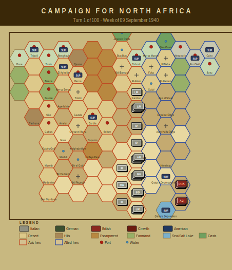

# Campaign Journal — Turn 1
## Week of 09 September 1940

*The Campaign for North Africa — AI Journal*
*Turn 1 of 100 | Operations Stage complete*

---

# Campaign Journal — Turn 1

## 9 September 1940

---

It begins. God help me, it begins.

I've spent the better part of three days just setting up the initial deployment, cross-referencing three volumes of rules, and now the war in North Africa has officially started — not with a thunderclap of armor, but with the soft, pathetic sound of twenty points of fuel evaporating into the Libyan heat.

Twenty-point-three fuel points. Gone. Not consumed by engines grinding toward Mersa Matruh. Not burned in glorious mechanized pursuit. Just... evaporated. The desert took them before a single shot was fired. I wrote the number down twice because I didn't believe it.

**The Italian Situation**

Marshal Graziani's 10th Army is arriving on the map, and I use the word "arriving" loosely, because what's actually happening is that thousands of Italian soldiers are materializing in the wasteland west of the wire with no water, no pasta, and in three cases — the 141st Catanzaro, 2nd Libyan Division HQ, and the 3rd Libyan Regiment — no supply at all.

Six Italian regiments are pasta-deprived. *Six.* The 125th and 126th Cirene, the 115th and 116th Marmarica, and both Catanzaro regiments. I actually had to look up the pasta rule again to make sure I was reading it correctly. Italian infantry units that don't receive their pasta ration suffer a morale penalty. This is not a joke rule. This is a real mechanical consequence of the historical Italian logistical system's insistence on providing hot pasta meals to frontline troops in the Sahara. Richard Berg, you magnificent lunatic.

And the water situation — I barely know where to start. Nearly every unit on the map is water-critical. Both sides, actually. The 7th Armoured Division, the Indians, everyone is parched. But the Italians have it worse because Tobruk's port depot is running low, and the chain from Tripoli is, at Turn 1, not yet anything resembling a chain. It's a suggestion. A rumor of logistics.

The four Libyan regiments are fuel-critical on top of everything else. These colonial troops are stranded. I'm wearing my Graziani hat and staring at the map and I genuinely cannot figure out how I'm supposed to advance on Egypt when I can't even hydrate the army at its starting positions.

**The British Situation**

Switching hats to Wavell now, and the picture is... tidy. Dangerously tidy. Only eight active units. The 7th Armoured Division — the Desert Rats — with both brigades already showing wear at two-thirds strength. The 4th Indian Division looking capable but thin. No one is out of supply, which feels like an impossible luxury after wrestling with the Italian logistics tables.

The plan, such as it is, must be delay and conservation. Let the Italians stumble forward into their own supply crisis. The 4th Armoured and 7th Armoured Brigades are too precious to risk in any engagement that isn't devastatingly favorable. Every step lost now is a step I won't have for Compass.

**Reflections**

The strange duality of solo play hit me tonight. I spent forty minutes optimizing the Italian supply distribution, genuinely trying to save Catanzaro from going completely out of supply — and then I turned to the British side and started calculating how to exploit exactly the weakness I'd just failed to fix. I am my own worst enemy. Literally.

I looked at the map — all ten feet of it, stretching across my dining table and onto a card table I've press-ganged into service — and thought: this is Turn 1 of 100. Ninety-nine more weeks of this. El Alamein is somewhere out there in Turn 80-something, an abstraction beyond imagining.

For now, there is only the wire, the heat, and the question of whether the 125th Cirene will get its pasta before someone has to answer for it.

Tomorrow: supply phase recalculations. I think I missed something with the Tobruk depot allocation. There's always something.

---

*Turn 2 next week. Graziani is supposed to advance. With what, I cannot yet say.*

---

## Situation Report

| Metric | Axis | Allied |
|--------|------|--------|
| Active units | 20 | 8 |
| Total steps | 50 | 17 |
| Out of supply | 3 | 0 |
| Eliminated | 0 | 0 |

### Supply Situation

**Fuel critical:** 1st Libyan Infantry Regiment, 2nd Libyan Infantry Regiment, 3rd Libyan Infantry Regiment
**Water critical:** 63rd Infantry Division 'Cirene' HQ, 125th Infantry Regiment 'Cirene', 126th Infantry Regiment 'Cirene'
**Out of supply:** 141st Infantry Regiment 'Catanzaro', 2nd Libyan Infantry Division HQ, 3rd Libyan Infantry Regiment
**Pasta-deprived (Italian):** 125th Infantry Regiment 'Cirene', 126th Infantry Regiment 'Cirene', 115th Infantry Regiment 'Marmarica'
**Fuel evaporated:** 20.3 points

### Critical Events
- 125th Infantry Regiment 'Cirene' critically short of water — combat effectiveness severely degraded
- 126th Infantry Regiment 'Cirene' critically short of water — combat effectiveness severely degraded
- 115th Infantry Regiment 'Marmarica' critically short of water — combat effectiveness severely degraded
- 116th Infantry Regiment 'Marmarica' critically short of water — combat effectiveness severely degraded
- 141st Infantry Regiment 'Catanzaro' critically short of water — combat effectiveness severely degraded

---

## Gamemaster's Ruling

I have reviewed the Turn 1 record for the week of 09 September 1940 in its entirety, cross-referencing each logged action against the eleven automated checks listed above.

All eleven checks returned clean, which is a fine start to the campaign. I took particular care to verify the arrival of the 63rd Infantry Division "Cirene" and its subordinate regiments against the reinforcement schedule under §4.1; the 10th Army HQ, the divisional HQ, the 125th and 126th Infantry Regiments, the 63rd Artillery Regiment, and the 62nd "Marmarica" HQ all appear at the correct hexes and on the correct turn. Placement at hexes 1404, 1405, and 1406 raises no issues under §6.2, and step counts for all arriving units conform to §8.1 bounds.

I do wish to note, with mild concern, the supply situation. The 141st Infantry Regiment "Catanzaro," the 2nd Libyan Division HQ, and the 3rd Libyan Infantry Regiment are flagged out of supply, and three "Cirene" and "Marmarica" regiments are recorded as pasta-deprived per §13.2's water and consumables provisions. Additionally, 20.3 fuel points lost to evaporation under §13.1 is not insignificant this early. None of these constitute violations — they are simply consequences the Italian player must address with some urgency before morale effects under §15.1 begin to compound.

The turn stands as submitted, with no corrections required.

— GamesmasterAnthony