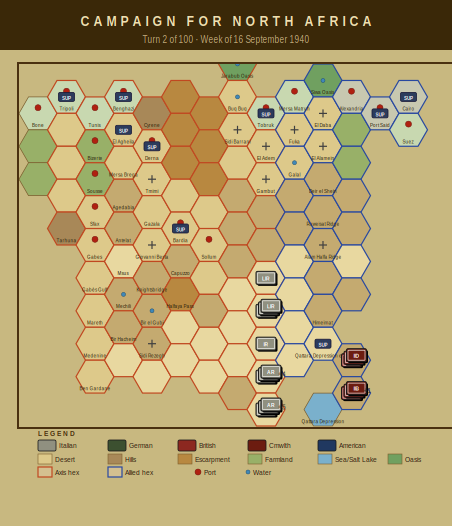

# Campaign Journal — Turn 2
## Week of 16 September 1940

*The Campaign for North Africa — AI Journal*
*Turn 2 of 100 | Operations Stage complete*

---

## Campaign for North Africa — Turn 2 (16 September 1940)

Graziani's advance is two weeks old and already the Italian logistics picture is dire. Eight Axis units are out of supply, and the water situation across the bulk of 10th Army has become the dominant feature of the game. Cirene, Marmarica, and Catanzaro divisions all have regiments critically short of water, which under the supply rules means halved combat effectiveness and movement restrictions. Phil spent most of the session staring at the supply tables rather than the map, which feels thematically appropriate for this theatre.

The pasta deprivation list now covers six Italian infantry regiments — both Cirene regiments, both Marmarica regiments, both Catanzaro regiments. The morale modifier is small per unit but cumulative across this many formations, and Phil is visibly annoyed about it. The rule does what it's designed to do: force the Axis player to account for a logistical burden the Allies simply don't have.

On the Allied side, the bad news is the 4th Armoured Brigade, which rolled a mechanical breakdown moving into hex 2009 and is down to one-third strength. Terry was philosophical about it — the breakdown tables are harsh on early-war British armour and this won't be the last time. The 7th Armoured Division otherwise remains intact and in supply.

Fuel evaporation cost 20.5 points this turn. Tobruk depot is running low. The 3rd Libyan Infantry Regiment is fuel-critical.

Heading into Turn 3, the question is whether Phil can get water forward before Catanzaro and Marmarica become functionally combat-ineffective. The Allies can afford to wait. The desert cannot.

---

### Player Notes

**Phil (Axis):** Turn 2 notes. The supply situation is already worse than I expected. Four units critically short of water — 125th and 126th Cirene, 62nd Marmarica HQ, and 115th Marmarica — which means their combat effectiveness is functionally gone. That's before we even talk about pasta. Three regiments are pasta-deprived (125th, 126th Cirene and 115th Marmarica), so they're eating cohesion penalties on top of the water crisis. Eight units OOS total, including 10th Army HQ and 63rd Cirene HQ, which is a problem because those HQs are supposed to be enabling supply distribution. Lost 20.5 fuel points to evaporation, which tracks at roughly 3% but still hurts when you're watching the stockpile shrink with twelve turns until the DAK shows up. Next turn I need to consolidate toward the coastal road and get a depot within range of the 63rd's forward elements. If I can't fix the water situation for those four units by Turn 3, I'm effectively down a division before the British even do anything interesting.

**Terry (Allied):** Right, well, that was a rough turn for doing absolutely nothing aggressive. 4th Armoured Brigade breaking down moving to 2009 is genuinely painful — down to one step, and that's a third of my mobile capability gone to a maintenance roll. I need to keep them stationary and hope for replacement steps, because I cannot afford to burn 7th Armoured the same way.

The water situation with 4th Indian Division is alarming. The HQ, 5th and 11th Indian Brigades all critically short — that's basically the whole division combat-ineffective. I need to trace their supply line carefully; something's wrong with my water allocation or I miscounted consumption. Historically Wavell had real water problems too, but this early it's embarrassing.

Twenty and a half fuel points evaporated feels steep. I'm going to audit my depot placement next turn — Cairo and Alexandria generate infinite supply but I'm clearly losing too much in transit. Phil's Italians haven't moved aggressively yet, which is expected; Graziani was cautious historically and the pasta logistics should keep 10th Army sluggish. Twelve turns until DAK arrives, so I have time, but not if my Indians are dying of thirst at the wire.

---

## Situation Report

| Metric | Axis | Allied |
|--------|------|--------|
| Active units | 20 | 7 |
| Total steps | 50 | 16 |
| Out of supply | 8 | 0 |
| Eliminated | 0 | 1 |

### Supply Situation

**Fuel critical:** 3rd Libyan Infantry Regiment
**Water critical:** 63rd Infantry Division 'Cirene' HQ, 125th Infantry Regiment 'Cirene', 126th Infantry Regiment 'Cirene'
**Out of supply:** Italian 10th Army HQ, 63rd Infantry Division 'Cirene' HQ, 63rd Artillery Regiment
**Pasta-deprived (Italian):** 125th Infantry Regiment 'Cirene', 126th Infantry Regiment 'Cirene', 115th Infantry Regiment 'Marmarica'
**Fuel evaporated:** 20.5 points

### Critical Events
- 125th Infantry Regiment 'Cirene' critically short of water — combat effectiveness severely degraded
- 126th Infantry Regiment 'Cirene' critically short of water — combat effectiveness severely degraded
- 62nd Infantry Division 'Marmarica' HQ critically short of water — combat effectiveness severely degraded
- 115th Infantry Regiment 'Marmarica' critically short of water — combat effectiveness severely degraded
- 116th Infantry Regiment 'Marmarica' critically short of water — combat effectiveness severely degraded

---

## Gamemaster's Ruling

Turn 2, week of 16 September 1940. Eleven checks run across the board — impassable hex occupation, step and supply bounds, unit positioning, depot capacity, reinforcement schedule, the works. Everything came back clean. No violations, no warnings. The turn stands.

That said, the Italian situation deserves comment even if it doesn't trigger a formal flag. Five units critically short on water — both regiments of the 63rd 'Cirene' and three elements of the 62nd 'Marmarica' — is ugly. Per §13.2, water levels are within legal bounds, but the combat effectiveness degradation is going to compound fast if supply lines aren't restored. The 10th Army HQ itself is out of supply, which under §12.1 means downstream distribution is going to keep deteriorating. Three units pasta-deprived on top of that — the morale implications per §15.1 are real even if current values pass bounds checks. And 20.5 fuel points evaporated is not trivial this early.

4th Armoured Brigade limping into hex 2009 at one step is legal under §8.1 but one more hit and §8.4 elimination applies. British player, keep that in mind.

Turn stands as played.

— Anthony