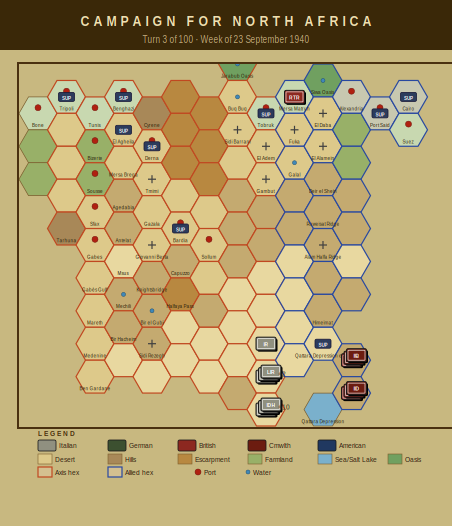

# Campaign Journal — Turn 3
## Week of 23 September 1940

*The Campaign for North Africa — AI Journal*
*Turn 3 of 100 | Operations Stage complete*

---

## Turn 3 — 23 September 1940

The Axis supply situation is now genuinely dire. Thirteen of Phil's nineteen units are out of supply, and the water crisis has spread across the bulk of his infantry establishment. Cirene, Marmarica, and Catanzaro divisions are all critically short of water at the HQ level, which under the supply rules cascades degraded combat effectiveness down through their subordinate regiments. The practical effect is that Phil has a large force on paper that can barely fight or move. Six Italian infantry regiments are also pasta-deprived — the famous CNA morale provision — which stacks another modifier on top of the water penalties. Anthony confirmed the cumulative effect: these units are operating at roughly half their printed combat values before terrain is even considered.

The Tobruk depot is flagged as low. Phil needs to sort out his port-to-forward logistics or this column will be combat-ineffective before it reaches anything worth attacking. 19.9 fuel points evaporated this turn, which is a painful bleed given how little margin the Axis fuel economy has.

On the Allied side, Terry received 6th Royal Tank Regiment at hex 2007, but the approach march went poorly elsewhere — 7th Armoured Division HQ broke down moving to 2009 (now at half strength) and 7th Armoured Brigade took a mechanical loss reaching 2010. Two breakdowns in one turn is bad luck. 4th Armoured Brigade remains at one-third steps. Terry's armour screen is brittle.

The irony of the position: Phil has mass but no water; Terry has supply but fragile units. Neither side is well placed to force an engagement. Next turn's supply phase will likely determine whether the Axis advance stalls completely or limps forward with enough capability to matter.

---

### Player Notes

**Phil (Axis):** Three turns in and the logistics situation is already ugly. The 63rd Cirene division is falling apart — both the division HQ and the artillery regiment are critically short on water, which means their combat effectiveness is basically decorative at this point. Same story with 62nd Marmarica's HQ and the 115th Regiment. Four units in critical water shortage, thirteen OOS total, and I've lost nearly 20 fuel points to evaporation. That's the Italian 3% rate doing its thing, and it's going to compound every turn.

The pasta situation is compounding the problem. The 125th, 126th, and 115th are all pasta-deprived, which stacks with their supply issues to make them genuinely useless in any serious engagement. I need to consolidate my forward depot situation and shorten supply lines before Turn 14 or the DAK arrives to find an Axis position held together with string. Next turn I'm pulling the worst-off Cirene elements back toward the depot chain — no point burning water on units that can't fight.

**Terry (Allied):** Rough turn. The 6th Royal Tank Regiment arriving at 2007 is welcome — I need armour depth east of Matruh — but 7th Armoured Brigade throwing a track at 2010 and dropping to two-thirds strength hurts. That's my primary mobile reserve limping before anyone's fired a shot. Mechanical breakdowns are brutal in this game; I need to nurse them back carefully rather than push west.

The water situation with 4th Indian Division HQ and 5th Indian Brigade is genuinely concerning. Degraded combat effectiveness on two units in my infantry screen is not trivial. I need to sort their supply line immediately — trace back to Alexandria and figure out where the water allocation went wrong. That's a bookkeeping problem I should have caught last turn.

Fuel evaporation at 19.9 points across thirteen OOS units is almost certainly Phil's problem, not mine — Italian 10th Army bleeding out in Cyrenaica. Good. Every point he loses now is a point he won't have when Graziani finally lurches forward. I'll keep watching that number climb with quiet satisfaction.

Next turn: fix water supply for 4th Indian, hold 7th Armoured in place to recover, position 6th RTR as a backstop around hex 1905.

---

## Situation Report

| Metric | Axis | Allied |
|--------|------|--------|
| Active units | 19 | 7 |
| Total steps | 49 | 15 |
| Out of supply | 13 | 0 |
| Eliminated | 1 | 2 |

### Supply Situation

**Fuel critical:** 4th Libyan Infantry Regiment
**Water critical:** 63rd Infantry Division 'Cirene' HQ, 125th Infantry Regiment 'Cirene', 126th Infantry Regiment 'Cirene'
**Out of supply:** 125th Infantry Regiment 'Cirene', 126th Infantry Regiment 'Cirene', 62nd Infantry Division 'Marmarica' HQ
**Pasta-deprived (Italian):** 125th Infantry Regiment 'Cirene', 126th Infantry Regiment 'Cirene', 115th Infantry Regiment 'Marmarica'
**Fuel evaporated:** 19.9 points

### Critical Events
- 63rd Infantry Division 'Cirene' HQ critically short of water — combat effectiveness severely degraded
- 63rd Artillery Regiment critically short of water — combat effectiveness severely degraded
- 62nd Infantry Division 'Marmarica' HQ critically short of water — combat effectiveness severely degraded
- 115th Infantry Regiment 'Marmarica' critically short of water — combat effectiveness severely degraded
- 116th Infantry Regiment 'Marmarica' critically short of water — combat effectiveness severely degraded

---

## Gamemaster's Ruling

Eleven checks run on Turn 3 and everything comes back clean — no violations, no boundary breaches, no phantom units floating in the void. The turn stands.

That said, let me flag what's developing even though it doesn't trigger a formal warning yet. The Italian supply picture is getting ugly fast. The 63rd Cirene and 62nd Marmarica divisional HQs are both critically short on water per §13.2, which is dragging combat effectiveness down hard. Three regiments out of supply, three pasta-deprived — the Italian player needs to sort the logistics chain before this cascades into a §15.2 disorganization problem next turn. Nineteen-point-nine fuel points evaporated is painful but legal.

On the Commonwealth side, 6th Royal Tank Regiment enters at 2007 per the §4.1 reinforcement schedule, confirmed correct. The mechanical breakdowns on 7th Armoured Division HQ and 7th Armoured Brigade are rough luck but both units remain above elimination threshold under §8.4, so they stay on the map.

Verdict: Turn 3 stands as played. No corrections required.

— Anthony