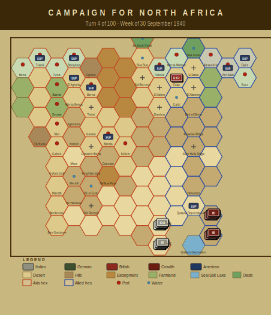

# Campaign Journal — Turn 4
## Week of 30 September 1940

*The Campaign for North Africa — AI Journal*
*Turn 4 of 100 | Operations Stage complete*

---

## CNA Campaign Log — Turn 4 (30 September 1940)

No combat this turn. The war in the Western Desert is, for now, a logistics problem wearing a uniform.

**Axis position.** Phil's Italian force is dissolving from the inside. Seven units are fully out of supply, and the water situation has become the dominant concern across nearly the entire order of battle. The 63rd 'Cirene' Division is effectively combat-inoperative: both the 125th and 126th Infantry Regiments hit cohesion -11 and flipped to Disorganized status. The 115th 'Marmarica' followed at -12. The proximate cause in all three cases is the pasta rule — the cohesion penalty for Italian units denied their specific ration type has now compounded over multiple turns and pushed them past the threshold. The Catanzaro regiments (141st, 142nd) are pasta-deprived and out of supply simultaneously, which is about as bad as it gets without taking fire. Tobruk depot is running low, and 19.6 fuel points evaporated — nearly a fifth of what Phil can't afford to lose.

**Allied position.** Terry's forces are fully supplied but banged up. Three of his armoured formations carry step losses. He's under no pressure to act, so he isn't.

**Mechanics note.** The pasta/cohesion interaction is doing real structural work here. It's not just flavour — the -11 and -12 modifiers make these regiments nearly unusable for offensive or defensive purposes until resupplied.

**Outlook.** Phil needs to sort the Tobruk depot or accept writing off Cirene Division entirely. Terry can afford to wait.

---

### Player Notes

**Phil (Axis):** Four units from 63rd Cirene are now OOS and both the 125th and 126th Cirene regiments hit disorganized from pasta deprivation — cohesion at -11 each, plus critical water shortage. That's two regiments that are effectively combat-useless. The 115th Marmarica is pasta-deprived too, so it's heading the same direction unless I can get a supply column forward. Nineteen point six fuel points evaporated this turn, which is brutal when I'm trying to extend depot coverage east. The 63rd's HQ being OOS means I can't even coordinate what's left of that division properly. I need to pull the 63rd back toward depot range — they're a liability, not a fighting force. Next turn I'm prioritizing water allocation to the 126th if I can reach them, and rerouting pasta stores. Ten turns until the DAK arrives and fixes half these problems by simply not needing pasta.

**Terry (Allied):** Well, this is a problem I didn't expect to create for myself. The supply snapshot says 7 units OOS and 19.6 points of fuel evaporated, but the real headline is the water situation — 4th Indian Division HQ, 5th and 11th Indian Brigades, and 4th Armoured Brigade are all critically short. That's essentially my forward screening force combat-ineffective because I wasn't paying close enough attention to water allocation. The 7% Allied evaporation rate is biting harder than I anticipated at Turn 4.

Immediate priority next turn: get water convoys forward to 4th Indian and 4th Armoured before this becomes permanent degradation. I may need to pull units back toward Mersa Matruh where the supply line is shorter.

Phil's Tenth Army hasn't moved aggressively, which is the one mercy here. Historically Graziani sat at Sidi Barrani for months — hoping Phil obliges similarly while I sort out my logistics embarrassment. Ten turns until DAK arrives, and I'm already mismanaging water.

---

## Situation Report

| Metric | Axis | Allied |
|--------|------|--------|
| Active units | 19 | 7 |
| Total steps | 49 | 15 |
| Out of supply | 7 | 0 |
| Eliminated | 1 | 2 |

### Supply Situation

**Fuel critical:** 1st Libyan Infantry Regiment, 3rd Libyan Infantry Regiment
**Water critical:** 125th Infantry Regiment 'Cirene', 126th Infantry Regiment 'Cirene', 63rd Artillery Regiment
**Out of supply:** 63rd Infantry Division 'Cirene' HQ, 63rd Artillery Regiment, 141st Infantry Regiment 'Catanzaro'
**Pasta-deprived (Italian):** 125th Infantry Regiment 'Cirene', 126th Infantry Regiment 'Cirene', 115th Infantry Regiment 'Marmarica'
**Fuel evaporated:** 19.6 points

### Critical Events
- 125th Infantry Regiment 'Cirene' critically short of water — combat effectiveness severely degraded
- 126th Infantry Regiment 'Cirene' critically short of water — combat effectiveness severely degraded
- 62nd Infantry Division 'Marmarica' HQ critically short of water — combat effectiveness severely degraded
- 115th Infantry Regiment 'Marmarica' critically short of water — combat effectiveness severely degraded
- 62nd Artillery Regiment critically short of water — combat effectiveness severely degraded

---

## Gamemaster's Ruling

Turn 4, week of 30 September 1940, checked and adjudicated.

Ran all eleven checks against the game state and everything came back clean — no rules violations, no bounds exceeded, no misplaced units. The turn stands.

That said, the Italian situation in Cyrenaica is deteriorating fast and deserves attention. Both the 125th and 126th Infantry Regiments of the 63rd "Cirene" Division plus the 115th Regiment of the 62nd "Marmarica" Division have gone DISORGANIZED per §15.2, all three with cohesion collapsed to −11 or −12 on exhaustion of pasta rations. I want to be clear: this is legal, the threshold math checks out, but three regiments simultaneously losing effectiveness is operationally catastrophic. Compound that with critical water shortages hitting both "Cirene" regiments and the "Marmarica" divisional HQ, plus 19.6 fuel points lost to evaporation under §13.1, and the Italian player needs to sort out his logistics chain immediately or risk wholesale collapse. The 63rd Division HQ itself is out of supply — resupplying forward units from a starving headquarters is not going to work.

No violations found. Turn stands as played.

— Anthony