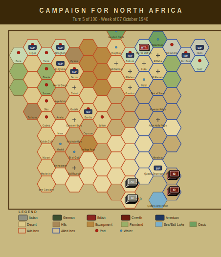

# Campaign Journal — Turn 5
## Week of 07 October 1940

*The Campaign for North Africa — AI Journal*
*Turn 5 of 100 | Operations Stage complete*

---

## Turn 5 — 07 October 1940

No combat this turn. The war is being fought entirely by the supply tables.

Thirteen of Phil's nineteen units are out of supply, and the water situation has crossed from concerning into mechanically catastrophic. Both regiments of 62nd 'Marmarica' — the 115th and 116th — have hit the pasta-deprivation disorganization threshold, with cohesion at -15 and -14 respectively. For anyone unfamiliar with this particular corner of the rules: Italian units require pasta as a distinct supply item, and prolonged deprivation applies cumulative cohesion penalties beyond normal food shortage effects. Six Italian regiments are now pasta-deprived. The 'Marmarica' regiments are simply the first to cross the disorganization line. They are combat-ineffective.

The water crisis is broader still — every unit on the board is water-critical, including Terry's force. The difference is that the Allied units remain in supply and can presumably address this through normal depot draws, while the Italian forward divisions cannot. The Tobruk depot is flagged as low, which constrains Phil's options for rerouting supply forward. Fuel evaporation claimed another 19.1 points, continuing to erode what little operational flexibility the Axis motorized units retain. The 2nd and 4th Libyan regiments are now fuel-critical.

Terry's armour is damaged — 4th Armoured Brigade at one-third strength — but supplied. Phil has mass but no logistics. The 'Cirene' division HQ and its artillery are water-critical, meaning even defensive fire is degraded.

Heading into Turn 6, Phil needs a supply miracle or a shorter line. Probably both.

---

### Player Notes

**Phil (Axis):** Five turns in and the Marmarica division is falling apart. The 115th going DISORGANIZED from pasta deprivation is the headline — cohesion at -15 means that regiment is essentially a speed bump now, not a fighting unit. I knew §38.5 would bite me eventually but losing cohesion this early is worse than I planned for. Three regiments pasta-deprived total, and I can't fix the allocation problem until I sort the depot linkage east of Bardia.

The water situation is arguably worse. Both the 63rd Cirene HQ and the 62nd Marmarica HQ critically short — that's two divisional HQs degraded, which cascades to everything they command. The 63rd Artillery is also dry. Thirteen units OOS overall, four formally OOS by name, 19.1 fuel points evaporated to the desert air. That's roughly a full turn's operational movement budget just gone.

Next turn I need to consolidate supply lines and pull the worst-off units back toward functioning depots rather than pretending they can hold forward positions while starving.

**Terry (Allied):** Four units critically short of water this turn and that's a problem I need to solve before anything else. 4th Indian Division HQ, 5th and 11th Indian Brigades, and 4th Armoured Brigade are all combat-degraded. That's essentially my forward screening force rendered useless if I can't get water forward. I'm losing 19.1 fuel points to evaporation which stings but the water crisis is the immediate fire. I need to check whether my supply line from Alexandria through Mersa Matruh has a bottleneck — suspect I've got a transport capacity issue rather than a source problem. Seven active units, thirteen OOS across the board, which tells me I'm overextended for my logistics. Next turn I'm pulling 4th Armoured back toward Matruh to shorten the supply chain. Phil's 10th Army isn't moving aggressively so I have time. The irony of a water crisis in a desert game is not lost on me.

---

## Situation Report

| Metric | Axis | Allied |
|--------|------|--------|
| Active units | 19 | 7 |
| Total steps | 49 | 15 |
| Out of supply | 13 | 0 |
| Eliminated | 1 | 2 |

### Supply Situation

**Fuel critical:** 2nd Libyan Infantry Regiment, 4th Libyan Infantry Regiment
**Water critical:** 63rd Infantry Division 'Cirene' HQ, 125th Infantry Regiment 'Cirene', 126th Infantry Regiment 'Cirene'
**Out of supply:** 125th Infantry Regiment 'Cirene', 62nd Infantry Division 'Marmarica' HQ, 115th Infantry Regiment 'Marmarica'
**Pasta-deprived (Italian):** 125th Infantry Regiment 'Cirene', 126th Infantry Regiment 'Cirene', 115th Infantry Regiment 'Marmarica'
**Fuel evaporated:** 19.1 points

### Critical Events
- 63rd Infantry Division 'Cirene' HQ critically short of water — combat effectiveness severely degraded
- 63rd Artillery Regiment critically short of water — combat effectiveness severely degraded
- 62nd Infantry Division 'Marmarica' HQ critically short of water — combat effectiveness severely degraded
- 115th Infantry Regiment 'Marmarica' critically short of water — combat effectiveness severely degraded
- 116th Infantry Regiment 'Marmarica' critically short of water — combat effectiveness severely degraded

---

## Gamemaster's Ruling

Turn 5, week of 07 October 1940. Ran the full eleven checks covering map legality, step and supply bounds, depot capacity, reinforcement schedule, and the rest. Everything passed clean — no violations detected, so the turn stands as submitted.

That said, the Italian situation in Cyrenaica is getting ugly and I want it on record. The 115th and 116th Infantry Regiments of the 62nd "Marmarica" Division have both gone DISORGANIZED under §15.2, with cohesion at −15 and −14 respectively. The cause is straightforward: pasta ration exhaustion collapsing morale faster than water shortage alone would. Yes, the pasta rule is real, and yes, it bites exactly this hard. The 63rd "Cirene" Division's HQ and artillery are critically short of water too, which compounds things. Three units are fully out of supply. The Italian player needs to sort the logistics chain out in the next turn or two, or these formations will start losing steps to attrition under §8.1 without the Commonwealth having to fire a shot. The 19.1 points of fuel evaporation under §13.1 is within bounds but worth watching as temperatures hold.

No warnings, no flags, turn stands.

— Anthony