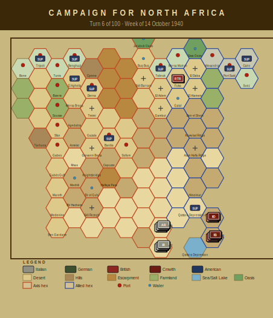

# Campaign Journal — Turn 6
## Week of 14 October 1940

*The Campaign for North Africa — AI Journal*
*Turn 6 of 100 | Operations Stage complete*

---

## Campaign for North Africa — Turn 6 (14 October 1940)

The Axis position is deteriorating faster than Phil can patch it. Ten of nineteen Italian units are now out of supply, and the water situation across the forward formations is approaching crisis. The 'Cirene', 'Marmarica', and 'Catanzaro' divisions are all critically short of water, which under the supply rules means halved combat effectiveness and mandatory cohesion checks. The 62nd Artillery Regiment and 64th 'Catanzaro' HQ are likewise affected — Phil is losing command capacity along with fighting strength.

The marquee event this turn: 115th Infantry Regiment 'Marmarica' has gone Disorganized after its pasta ration ran out entirely, dropping cohesion to −18. This is the famous CNA pasta rule doing real work — Italian units require pasta as a distinct supply item, and failure to deliver it produces morale penalties that stack with other deprivations. At −18 the unit is combat-useless and vulnerable to forced retreat or elimination on contact. Phil noted, with admirable restraint, that he had tried to route pasta forward through Tobruk but the depot there is running low on everything. The 18.6 fuel points lost to evaporation this turn didn't help the logistics picture either.

On the Allied side, Terry received the 6th Australian Division — HQ and two brigades entering at hexes 2013–2014. Fresh, fully supplied, and adding real depth behind the battered 7th Armoured and 6th RTR. Those two formations remain damaged but functional.

The fuel-critical status on both Libyan infantry regiments is worrying for Phil. If those units lose mobility next turn, the already-thin Axis line may develop gaps Terry can exploit once the Australians move forward. Anthony is reviewing supply trace legality for the 'Catanzaro' units — resolution next session.

---

### Player Notes

**Phil (Axis):** Ten units out of supply now, and the 63rd Cirene division is basically a write-off. The whole formation — HQ, 125th, 126th, artillery regiment — all OOS, and the 125th is critically short on water too. They're sitting around hex 1503 doing absolutely nothing useful. I can't push supply forward fast enough to reach them, and 18.6 points of fuel evaporated this turn which is eating into what I'd need for truck columns to close that gap.

The real disaster is the 115th Marmarica hitting disorganized from pasta deprivation. Cohesion at minus eighteen. That regiment is combat-useless until I can reconstitute it, and reconstitution requires supply I don't have. The Marmarica HQ is also critically dry.

Next turn I'm pulling everything I can back toward Bardia. Eight turns until DAK arrives and I just need to not collapse before then.

**Terry (Allied):** Good news and bad news this turn. The 6th Australian Division is starting to arrive — HQ at 2013, 16th Brigade same hex, 17th Brigade adjacent at 2014. That's welcome reinforcement, though they'll need a few turns to organize and push west. I'm keeping them east of Mersa Matruh for now. No reason to rush anybody forward while Phil's logistics eat themselves alive.

The bad news is 4th Indian Division HQ is critically short on water. That's annoying — they're my best-positioned forward formation and now their combat effectiveness is degraded. I need to sort that supply line immediately or pull them back a hex to fix it. Eighteen point six fuel evaporated this turn, which stings, but Phil has ten units OOS against my zero, so relatively speaking I'm winning the supply war by doing nothing.

Seven Armoured stays put. DAK is eight turns away and I want them fresh when it matters.

---

## Situation Report

| Metric | Axis | Allied |
|--------|------|--------|
| Active units | 19 | 9 |
| Total steps | 49 | 21 |
| Out of supply | 10 | 0 |
| Eliminated | 1 | 3 |

### Supply Situation

**Fuel critical:** 1st Libyan Infantry Regiment, 3rd Libyan Infantry Regiment
**Water critical:** 125th Infantry Regiment 'Cirene', 126th Infantry Regiment 'Cirene', 63rd Artillery Regiment
**Out of supply:** 63rd Infantry Division 'Cirene' HQ, 125th Infantry Regiment 'Cirene', 126th Infantry Regiment 'Cirene'
**Pasta-deprived (Italian):** 125th Infantry Regiment 'Cirene', 126th Infantry Regiment 'Cirene', 115th Infantry Regiment 'Marmarica'
**Fuel evaporated:** 18.6 points

### Critical Events
- 125th Infantry Regiment 'Cirene' critically short of water — combat effectiveness severely degraded
- 62nd Infantry Division 'Marmarica' HQ critically short of water — combat effectiveness severely degraded
- 115th Infantry Regiment 'Marmarica' critically short of water — combat effectiveness severely degraded
- 116th Infantry Regiment 'Marmarica' critically short of water — combat effectiveness severely degraded
- 62nd Artillery Regiment critically short of water — combat effectiveness severely degraded

---

## Gamemaster's Ruling

Turn 6, week of 14 October 1940. Eleven checks run across the board — impassable hex occupation, step counts, fuel and water bounds, map positions, elimination marking, disorganization thresholds, hex control, morale, depot capacity, and the reinforcement schedule. Everything came back clean, no violations.

The 6th Australian Division HQ and 16th Brigade arriving at 2013, with 17th Brigade at 2014, all check out against the §4.1 reinforcement schedule. No issues there.

The interesting story this turn is on the Italian side. The 115th Infantry Regiment "Marmarica" hitting DISORGANIZED status via pasta deprivation is legitimate under §15.2 — cohesion at negative eighteen is well past the threshold, and yes, the pasta rule is real and it matters. Three Cirene units out of supply and two regiments pasta-deprived alongside 115th means the Italian logistical situation is deteriorating fast. The 18.6 fuel points lost to evaporation under §13.1 passed bounds but that is not a number to ignore.

No warnings, no flags. Turn stands.

— Anthony