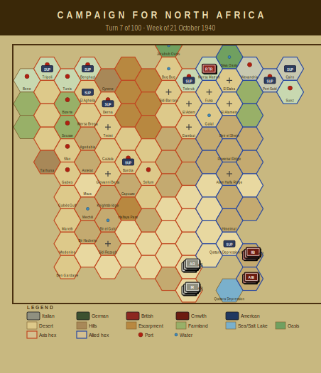

# Campaign Journal — Turn 7
## Week of 21 October 1940

*The Campaign for North Africa — AI Journal*
*Turn 7 of 100 | Operations Stage complete*

---

## Turn 7 — 21 October 1940

Phil's supply situation has gone from bad to structurally unsound. Eleven of nineteen Axis units are now out of supply, and the water crisis has spread across virtually the entire forward deployment. Cirene, Marmarica, and Catanzaro divisions are all water-critical at headquarters level or below, which mechanically means degraded combat effectiveness across the board — not individual regiments struggling, but entire divisional structures compromised. The 63rd Artillery Regiment being water-critical is particularly painful since it removes what little offensive punch Cirene had left.

The Maletti Group took a mechanical breakdown result moving into hex 1710, dropping to two-thirds strength. Already at one-third steps from earlier attrition, this effectively halves its remaining combat power. Phil noted it was the only mobile exploitation unit he had positioned forward. It is also out of supply.

The pasta-deprivation rules made themselves felt this turn in a concrete way: 125th Infantry Regiment (Cirene) hit the cohesion threshold at -19 and flipped to Disorganized status. Six Italian regiments total are pasta-deprived. The mechanic accumulates cohesion penalties each turn the ration isn't met, so unless Phil gets the logistics sorted, more units will cross the disorganization line soon. 141st and 142nd Catanzaro are next to watch.

Terry's Allies remain fully supplied with no units out of supply. The 6th RTR is damaged but functional. Fuel evaporation cost 18.2 points this turn — the Tobruk depot is flagged low.

Heading into Turn 8, the question is whether Phil can stabilize the supply network before more formations collapse. The answer, based on current depot status, looks like no.

---

### Player Notes

**Phil (Axis):** Eleven units out of supply now, which is worse than I projected. The 126th Cirene and the whole 62nd Marmarica cluster going OOS is directly because I let the depot gap east of Bardia get too wide — I need to leapfrog a depot forward next turn or I'm losing the entire Marmarica division's combat value before the British even engage.

The 125th Cirene situation is genuinely dire: no pasta, no water, cohesion at -19 and disorganized. That regiment is combat-useless. I'm writing it off as a speed bump. The 63rd Cirene HQ being critically short of water means the whole division is degrading as a formation.

Maletti Group breaking down at 1710 hurts — that's my only mechanized punch pre-DAK and now it's at two-thirds strength without firing a shot. Seven more turns until Rommel arrives.

18.2 fuel points evaporated this turn. I'm running the math on whether I can even sustain offensive operations past Turn 10 at this burn rate, and the answer is probably no unless I consolidate hard around Tobruk and stop trying to push units I can't feed.

**Terry (Allied):** Three units critically short of water in one turn is a real problem. 5th Indian Brigade and 11th Indian Brigade are both degraded — that's the core of 4th Indian Division's combat power effectively halved. The 6th Australian Division HQ and 16th Australian Brigade being hit too means I've got command and fighting strength compromised across two formations simultaneously. I need to trace what happened with the water distribution — 18.2 points of fuel evaporation is already painful, and if water allocation got misrouted or I simply under-ordered, that's on me.

Immediate priority next turn: get those four units resupplied before anyone drops to OOS. I'm pulling 6th Australian HQ closer to the Matruh depot if necessary. None of my 8 active units are OOS yet, which is the one silver lining. Phil's 10th Army should be suffering worse, but I can't let my own logistics rot while I wait for his to collapse — DAK is seven turns out and I need healthy formations when Rommel shows up.

---

## Situation Report

| Metric | Axis | Allied |
|--------|------|--------|
| Active units | 19 | 8 |
| Total steps | 47 | 19 |
| Out of supply | 11 | 0 |
| Eliminated | 1 | 4 |

### Supply Situation

**Fuel critical:** 2nd Libyan Infantry Regiment, 4th Libyan Infantry Regiment
**Water critical:** 63rd Infantry Division 'Cirene' HQ, 125th Infantry Regiment 'Cirene', 126th Infantry Regiment 'Cirene'
**Out of supply:** 126th Infantry Regiment 'Cirene', 62nd Infantry Division 'Marmarica' HQ, 116th Infantry Regiment 'Marmarica'
**Pasta-deprived (Italian):** 125th Infantry Regiment 'Cirene', 126th Infantry Regiment 'Cirene', 115th Infantry Regiment 'Marmarica'
**Fuel evaporated:** 18.2 points

### Critical Events
- 63rd Infantry Division 'Cirene' HQ critically short of water — combat effectiveness severely degraded
- 125th Infantry Regiment 'Cirene' critically short of water — combat effectiveness severely degraded
- 126th Infantry Regiment 'Cirene' critically short of water — combat effectiveness severely degraded
- 63rd Artillery Regiment critically short of water — combat effectiveness severely degraded
- 116th Infantry Regiment 'Marmarica' critically short of water — combat effectiveness severely degraded

---

## Gamemaster's Ruling

Turn 7, 21 October 1940. Ran the full eleven checks against the game state and everything came back clean — no violations on hex placement, step counts, fuel and water bounds, depot capacities, morale ranges, or reinforcement timing. The turn stands.

That said, the Italian player needs to pay close attention to the 63rd Cirene division. The 125th Infantry Regiment hitting disorganized status with cohesion at negative nineteen is legal per §15.2 but just barely — one more tick down and I'll be watching for missed elimination under §8.4 if steps erode further. The pasta situation is real; per §13.4(c) Italian units require their pasta ration for full cohesion recovery, and three units across two divisions are now deprived. Combined with the water crisis hitting nearly every Cirene element plus three out-of-supply units, the Tenth Army's logistical position is deteriorating fast. Maletti Group losing a step to breakdown at 1710 is noted and legal under §7.3.

No action required from me. Turn stands as played.

— Anthony