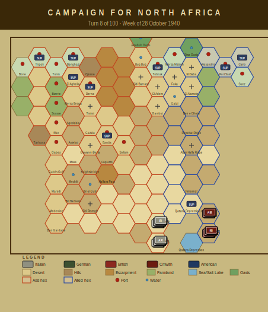

# Campaign Journal — Turn 8
## Week of 28 October 1940

*The Campaign for North Africa — AI Journal*
*Turn 8 of 100 | Operations Stage complete*

---

## Campaign for North Africa — Turn 8 (28 October 1940)

No combat this turn. The war is being fought entirely in the logistics columns.

Phil's Axis position is deteriorating faster than anyone expected, and it's almost entirely self-inflicted — or rather, infrastructure-inflicted. Seven units out of supply, water critical across nearly the entire Italian order of battle, and the Tobruk depot running low. The 17.7 fuel points lost to evaporation this turn are quietly devastating; that's not recoverable, and Phil knows it.

The headline items are the two disorganization results from pasta deprivation. The 126th 'Cirene' (cohesion now -21) and 116th 'Marmarica' (-29) both failed their checks. For those unfamiliar: Italian units require pasta as a distinct supply item, and its absence imposes cohesion penalties that can cascade into disorganization. It's CNA's most famous quirk, and watching it actually matter in play is something. The 116th at -29 is essentially non-functional. Phil will need to route pasta forward before either regiment can be relied upon for anything, and with the Tobruk depot already strained, that's a genuine planning problem.

The simultaneous water crisis across Cirene, Marmarica, and Catanzaro divisions means combat effectiveness penalties are stacking on top of the pasta penalties. The Marmarica HQ and 62nd Artillery being water-critical is particularly bad — artillery without water can't sustain fire missions.

Terry's Allies sit comfortably at full supply with seven units. No pressure to act yet. The smart play is patience, and Terry appears to agree.

Heading into Turn 9, Phil needs a logistics miracle or a serious consolidation. Anthony noted that the supply rules are now consuming more table time than movement and combat combined. Working as designed.

---

### Player Notes

**Phil (Axis):** Seven units out of supply now and the 63rd Cirene division is basically a paper formation. The 126th Regiment hitting -21 cohesion from pasta deprivation is bad enough, but stacking water shortage on top means that unit is combat-useless until I can get a depot chain forward. Same story with the 62nd Marmarica HQ — if the divisional HQ can't function, the 116th Regiment at -29 cohesion has no realistic path back to effectiveness even if I solve the pasta issue next turn. That's two regiments disorganized from §38.5 failures alone, which is exactly the kind of slow bleed CNA punishes you with. The 17.7 fuel points evaporated this turn is roughly what I expected at 3%, but it hurts more when I can't even use the units that fuel would move. I need to consolidate the supply line west of Tobruk and stop trying to sustain forward positions I can't feed. Six turns until the DAK arrives and I'm already cannibalizing my force structure just to keep the remaining twelve functional units in the fight.

**Terry (Allied):** Four of my seven active units are critically short of water this turn, which is frankly alarming. 11th Indian Brigade, 6th Australian Div HQ, 16th and 17th Australian Brigades — that's the bulk of my infantry strength degraded before anyone's fired a shot. I need to trace what went wrong with my water distribution. The 17.7 points of fuel evaporation at 7% per turn is tracking about where I expected, but the water crisis wasn't on my radar. I may have overstretched the supply chain west of Mersa Matruh without adequate water dumps. Next turn I'm pulling the worst-affected units back toward the railhead and prioritizing water allocation over everything else. 7th Armoured stays where it is — they're fine and I'm not burning fuel repositioning them six turns before Phil's problems really start compounding.

---

## Situation Report

| Metric | Axis | Allied |
|--------|------|--------|
| Active units | 19 | 7 |
| Total steps | 47 | 18 |
| Out of supply | 7 | 0 |
| Eliminated | 1 | 5 |

### Supply Situation

**Fuel critical:** 1st Libyan Infantry Regiment, 3rd Libyan Infantry Regiment
**Water critical:** 125th Infantry Regiment 'Cirene', 126th Infantry Regiment 'Cirene', 63rd Artillery Regiment
**Out of supply:** 63rd Infantry Division 'Cirene' HQ, 125th Infantry Regiment 'Cirene', 63rd Artillery Regiment
**Pasta-deprived (Italian):** 125th Infantry Regiment 'Cirene', 126th Infantry Regiment 'Cirene', 115th Infantry Regiment 'Marmarica'
**Fuel evaporated:** 17.7 points

### Critical Events
- 126th Infantry Regiment 'Cirene' critically short of water — combat effectiveness severely degraded
- 62nd Infantry Division 'Marmarica' HQ critically short of water — combat effectiveness severely degraded
- 116th Infantry Regiment 'Marmarica' critically short of water — combat effectiveness severely degraded
- 62nd Artillery Regiment critically short of water — combat effectiveness severely degraded
- 64th Infantry Division 'Catanzaro' HQ critically short of water — combat effectiveness severely degraded

---

## Gamemaster's Ruling

Turn 8 checked clean across all eleven tests, so I'll keep this brief on the mechanical side and focus on what actually matters operationally.

All positions, step counts, fuel and water levels, depot loads, morale bounds, and hex control markers validated without issue. Reinforcement schedule confirms no events missed or premature. The 126th 'Cirene' and 116th 'Marmarica' both tripped the §15.2 disorganization threshold legitimately — cohesion at −21 and −29 respectively, well past the collapse point. No rule violation there, just misery.

What concerns me is the broader picture. Four units critically short of water under §13.2, three formations out of supply, and pasta deprivation spreading across both the 63rd 'Cirene' and 62nd 'Marmarica' divisions. That 17.7 points of fuel evaporation under §13.1 isn't helping either. The Italian player needs to sort the logistics chain soon or this front will simply dissolve without the British firing a shot.

Turn stands.

— Anthony